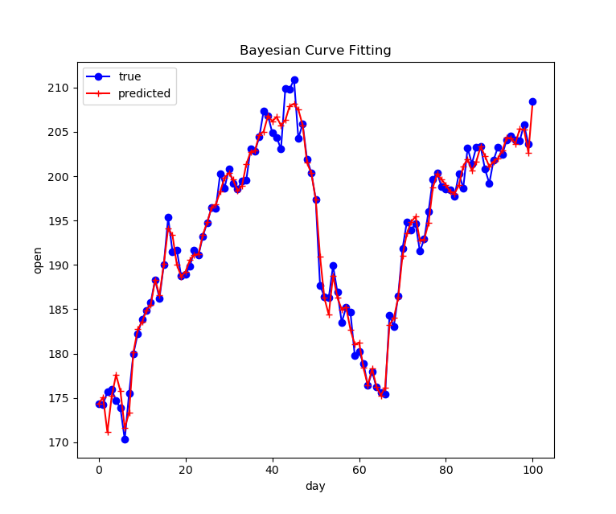

# Bayesian Curve Fitting Model

A basic Bayesian curve fitting model designed for [StockProject](https://github.com/Bluefissure/StockProject).

## Requirement

Python 3.6+ with

- codecs
- numpy

You should use `pip install codecs` and `pip install numpy` to install these dependencies.

## Use

You can read the help information with command `python main.py --help`.

Examples are like:

- `python .\src\main.py --file db/hist/ATVI.csv` which
  - uses `hist/ATVI.csv` as data source
- `python .\src\main.py --file db/hist/ATVI.csv -bf gaussian -d 128` which
  - uses `hist/ATVI.csv` as data source
  - has a 128-degree gaussian function as the basic function used for bayesian curve fitting
- `python .\src\main.py --file db/hist/AAPL.csv -bf polynomial -d 64` which
  - uses `hist/AAPL.csv` as data source
  - has a 64-degree polynomial function as the basic function used for bayesian curve fitting

## Performance

- Fitting is okay
- Predicting stock is dreaming
- Gaussian works better than others
- Easily get overfitting

